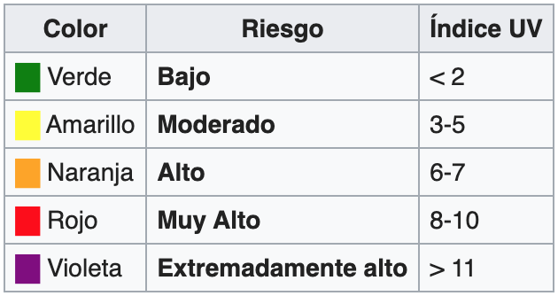
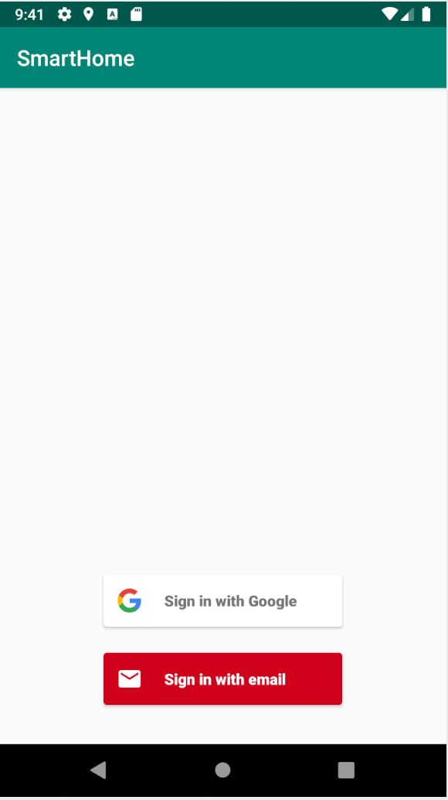
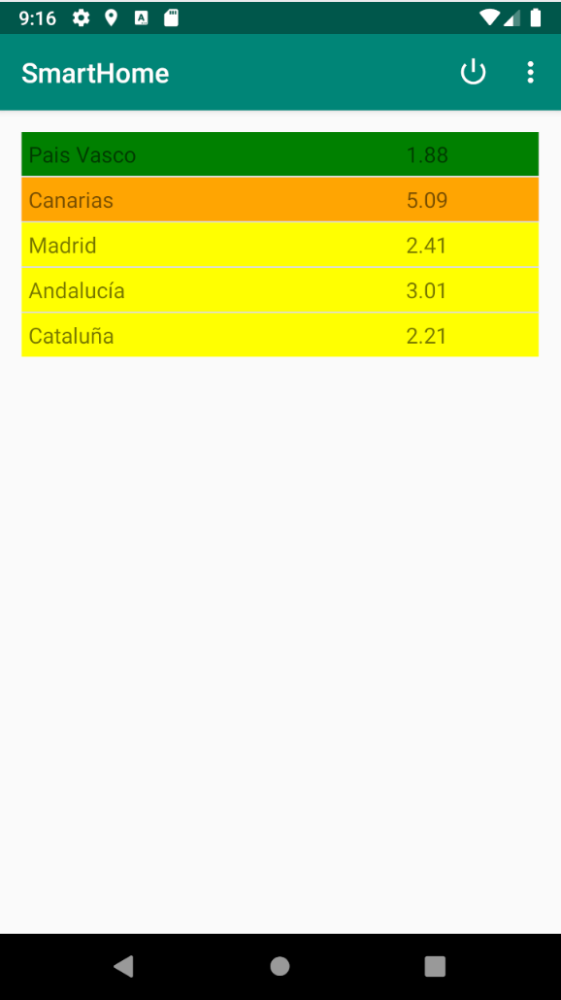
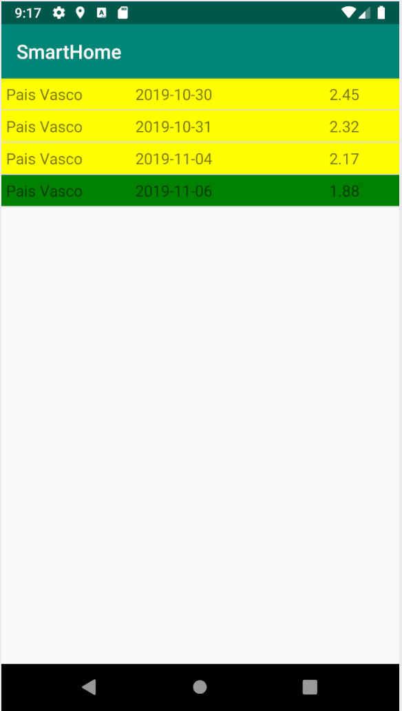
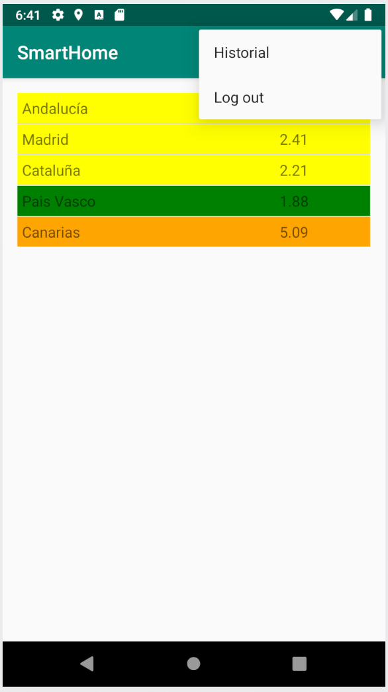
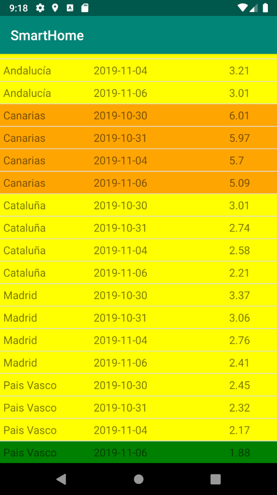

# Descripción.

Se realizará una app que obtenga la radiación ultravioleta de varias localizaciones de españa y mostrará un aviso en color según su peligrosidad.

# Login

Al entrar encontraremos el logín. Podremos acceder mediante correo o cuenta de google.

# Localizaciones

Una vez autenticados, se nos mostrará una lista de localizaciones con la radiación actual, obtenida de: https://api.openweathermap.org

Al pulsar en una de las localizaciones, se encendará la lámpara inteligente del color que indica. Además, se mostrará una lista con el historico de radiación en esa localización.

En la vista de localizaciones, tendremos un menu superior donde podremos:

- Apagar la lampara.
- Hacer log out.
- Mostrar un histotrial completo de radiación.

# Historial completo.

# Firebase

Una vez obtenida la información, esta es alojada en la base de datos de firebase mediante claves compuestas por la localización y la fecha. De esta manera, solo guardamos la información de cada localización una vez por día.

Para mostrar el historial, realizamos una petición para obtener toda esta información. En caso de ser el historial de una localización en concreto, filtramos los datos una vez completada la petición.